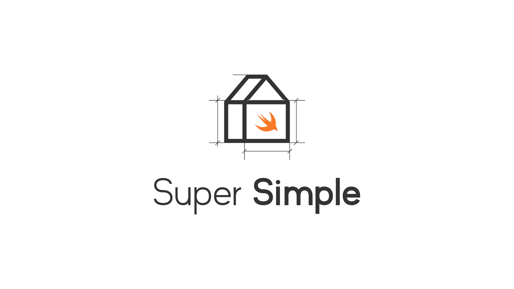

### Super Simple Application Architecture you can learn in minutes.

We believe we should compose software from components.

> Nobody is really smart enough to program computers.
> - Steve McConnell (Code Complete 2.0)

Here's our base expectations from those elements:

- accurately named,
- simple,
- small,
- responsible for one thing,
- reusable.

# Components

## Types:

- Active Components (ex. Interactor, Navigation, Mediator etc.)
- Passive Components (ex. Renderable)
- Views (ex. UILabel)

## Renderable

> **Renderable**
> (*noun*)
> 
> Something (information) that view is able to show.

### Definitions

### TL;DR

Renderable is a struct that you pass to a View which should show its contents.

#### Renderable is:

- dead, 
- immutable struct,
- threadsafe,
- often converted from model or models,
- responsible for formatting data for presentation text (ex. dates, numbers).

```swift
struct BannerRenderable {
    let message: String
}
```

#### View should:

- always look the same if ordered to render the same renderable,
- have code answering to the question: "how should I look?",
- have no state,
- accept infinite number of renderables in random order.

### Example

**Step 1 - Create Renderable:**

```swift
struct BannerRenderable {
    let message: String

    init(what: String) {
        message = "Only 🍎 has \(what)" // #courage ;)
    }
}
```

**Step 2 - Expose View ability in Protocol:**

```swift
protocol BannerRendering: class {
    func render(_ renderable: BannerRenderable)
}
```

**Step 2 - Implement View:**

```swift
final class BannerView: UIView {
    @IBOutlet fileprivate var bannerLabel: UILabel!
}

extension BannerView: BannerRendering {
    func render(_ renderable: BannerRenderable) {
        bannerLabel.text = renderable.message
    }
}
```

